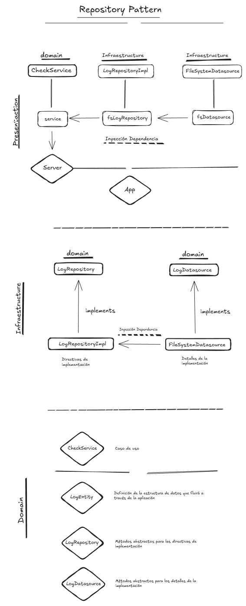
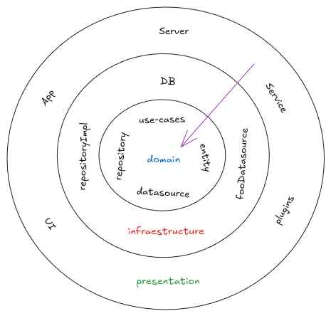

### Rest Server Clean Architecture

 

---

 

# Repository Pattern

## 1. Capa de Presentación (Presentation Layer)

- **CheckService**: Servicio del dominio que utiliza el repositorio para realizar operaciones relacionadas con los datos. Actúa como un intermediario entre la lógica de dominio y la capa de infraestructura.
- **Server/App**: La capa de presentación, ya sea un servidor o una aplicación, interactúa con el servicio `CheckService` para manejar solicitudes y respuestas de usuarios o sistemas.

### Flujo:

- El **CheckService** interactúa con el repositorio (`fsLogRepository`), el cual es inyectado a través de **Inyección de Dependencias**.
- La lógica de negocio reside en el **CheckService**, y delega la persistencia de datos al repositorio.

## 2. Capa de Infraestructura (Infrastructure Layer)

- **LogRepositoryImpl**: Implementación concreta del repositorio que maneja las directivas de implementación. Este repositorio interactúa con la fuente de datos (ej. sistema de archivos).
- **FileSystemDatasource**: Fuente de datos específica, en este caso, un sistema de archivos que gestiona la persistencia de datos (lectura/escritura).

### Relación:

- **LogRepositoryImpl** implementa la interfaz del repositorio (`LogRepository`) definida en el dominio, permitiendo que `CheckService` trabaje de manera desacoplada del sistema de persistencia.
- **LogRepositoryImpl** utiliza **FileSystemDatasource** para acceder a la fuente de datos y realizar las operaciones necesarias. Esta interacción también se gestiona mediante **Inyección de Dependencias**.

## 3. Capa de Dominio (Domain Layer)

- **CheckService**: Caso de uso que encapsula la lógica del negocio. Aquí reside la lógica que define cómo interactuar con los datos sin preocuparse por los detalles de persistencia.
- **LogEntity**: Entidad que representa la estructura de un log que fluirá a través de la aplicación. Es el modelo de datos que representa los logs en el sistema.
- **LogRepository**: Interfaz que define los métodos abstractos que el repositorio debe implementar para interactuar con los logs.
- **LogDatasource**: Interfaz que define los métodos abstractos para las interacciones con las fuentes de datos (en este caso, el sistema de archivos).

### Interacción:

- **LogRepository** define la interfaz abstracta que será implementada por `LogRepositoryImpl`.
- **LogDatasource** es una interfaz abstracta que será implementada por `FileSystemDatasource`, definiendo cómo interactuar con el sistema de almacenamiento.

## Resumen de la Arquitectura

### Capa de Presentación:

- La **App/Server** envía solicitudes al **CheckService**.
- El **CheckService** maneja la lógica de negocio.

### Capa de Infraestructura:

- El **CheckService** utiliza el **LogRepositoryImpl** para realizar las operaciones de persistencia.
- **LogRepositoryImpl** accede a la fuente de datos mediante el **FileSystemDatasource**.

### Capa de Dominio:

- El **LogRepository** y **LogDatasource** son interfaces que desacoplan la lógica de negocio de los detalles de implementación de persistencia.

## Beneficios del Patrón de Repositorio

- **Desacoplamiento**: La lógica de negocio del dominio está desacoplada de los detalles de implementación de la infraestructura (p. ej., base de datos o sistema de archivos).
- **Facilidad de pruebas**: Las interfaces claras y las dependencias inyectadas permiten realizar pruebas unitarias simulando las implementaciones de repositorios y fuentes de datos.
- **Flexibilidad**: Se puede cambiar la implementación del repositorio o de la fuente de datos sin afectar la lógica de negocio.

Este enfoque fomenta un código más modular, mantenible y fácil de extender.

---

> Este patrón permite mantener la lógica de negocio separada de la infraestructura, haciendo que el sistema sea más flexible y fácil de mantener a largo plazo.

 

---

 

## Diagrama de Arquitectura

## Descripción de las Capas

### 1. Capa de Presentación (Presentation Layer)

La capa más externa es donde interactúan los usuarios. Esta capa se encarga de recibir las solicitudes de los usuarios y enviar las respuestas.

Componentes:

- **UI**: Interfaz de usuario.
- **App**: Aplicación cliente.
- **Server**: Servidor o backend que maneja las solicitudes.

### 2. Capa de Infraestructura (Infrastructure Layer)

En esta capa se encuentran los detalles técnicos de la aplicación, como la persistencia de datos y las interacciones con bases de datos o servicios externos. Esta capa se comunica con el **Repositorio** y el **Datasource**.

Componentes:

- **repositoryImpl**: Implementación concreta del repositorio.
- **fooDatasource**: Fuente de datos que maneja la persistencia.
- **Service**: Servicios adicionales que proveen funcionalidades a la aplicación.
- **plugins**: Extensiones o complementos que añaden funcionalidades extras.

### 3. Capa de Dominio (Domain Layer)

El núcleo de la aplicación donde reside la lógica de negocio. Esta capa es independiente de las otras y define cómo debe comportarse la aplicación.

Componentes:

- **domain**: Reglas de negocio y lógica central de la aplicación.
- **use-cases**: Casos de uso que definen acciones específicas que puede realizar el dominio.
- **repository**: Abstracción que permite interactuar con la capa de infraestructura sin acoplarse a detalles técnicos.
- **datasource**: Abstracción para la interacción con fuentes de datos.
- **entity**: Representación de los datos que fluyen a través de la aplicación.

## Flujo de la Arquitectura

1. Las **solicitudes** comienzan en la capa de presentación (UI/App/Server).
2. La capa de presentación interactúa con la **lógica de dominio** (use-cases y entidades).
3. El **dominio** maneja los casos de uso, y a través del **repositorio**, interactúa con la capa de infraestructura.
4. La capa de **infraestructura** gestiona el acceso a las fuentes de datos reales (DB, servicios externos).

## Referencias

- **Datasource**: Componente que maneja la persistencia de los datos.
- **Repository**: Intermediario entre el dominio y la infraestructura, que gestiona el acceso a los datos.
- **Domain**: La parte central de la lógica de negocio de la aplicación.
